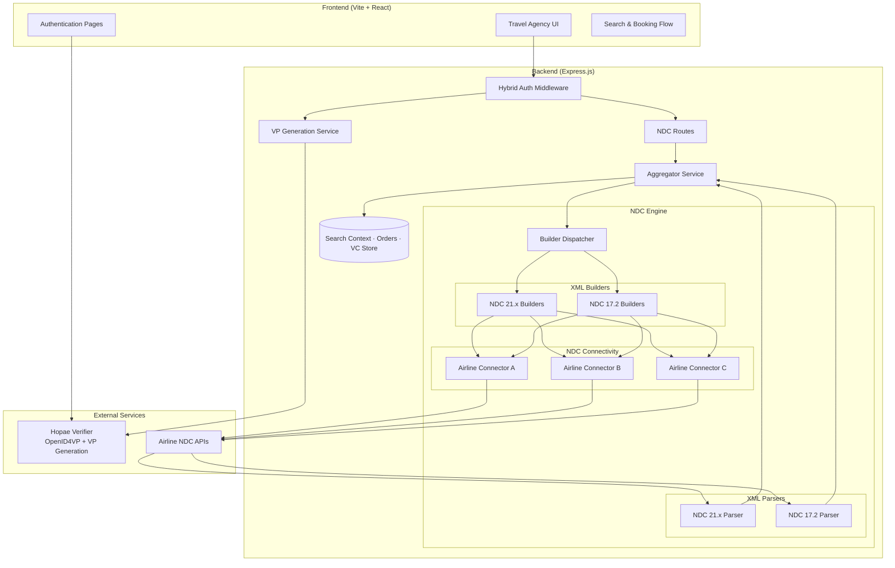
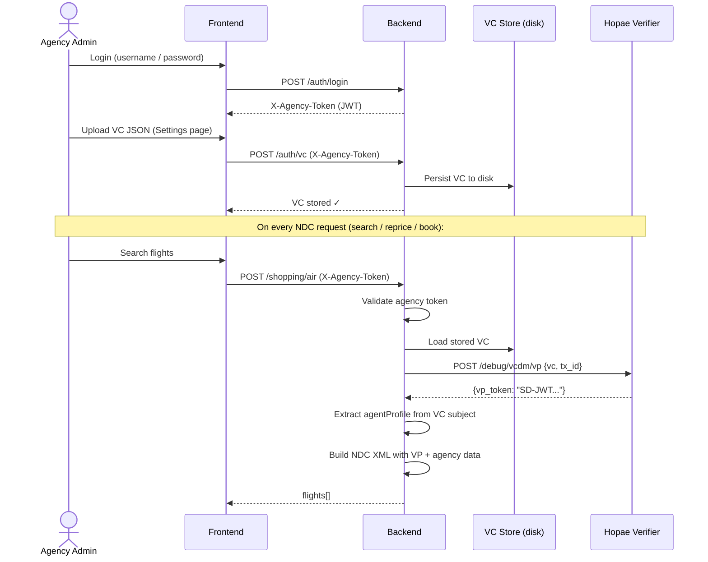
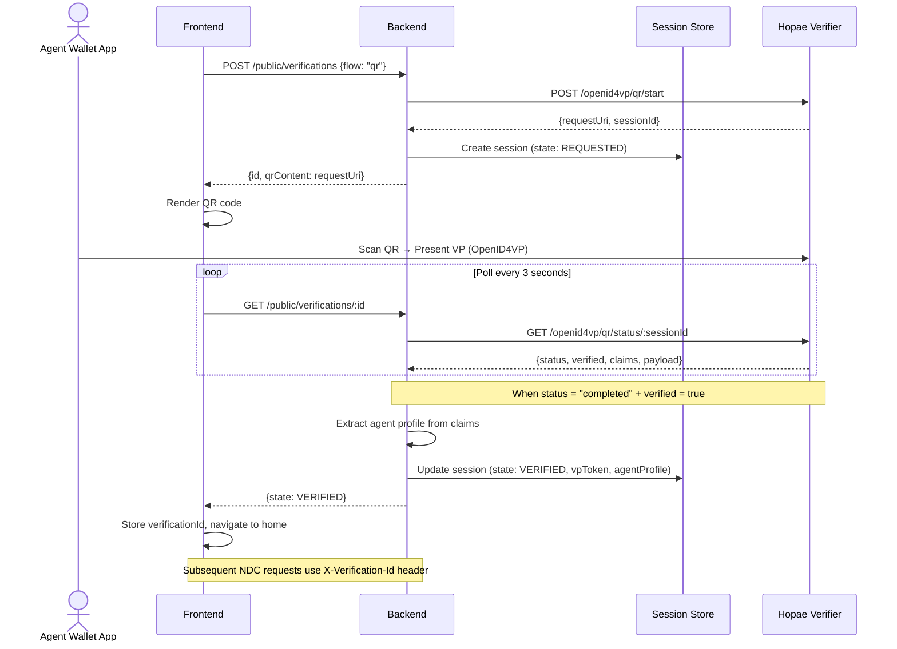
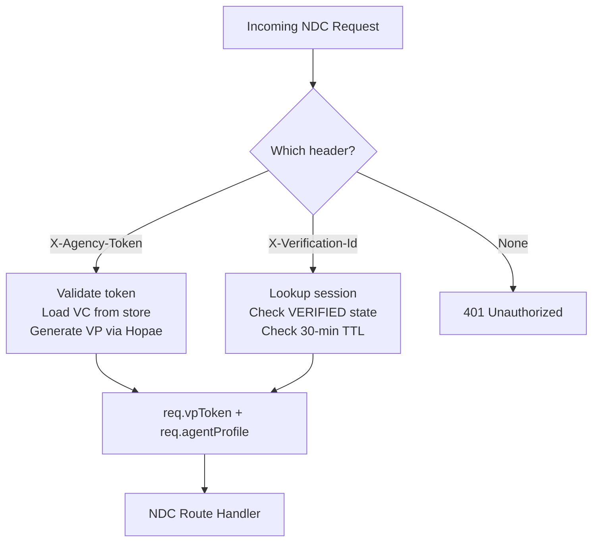
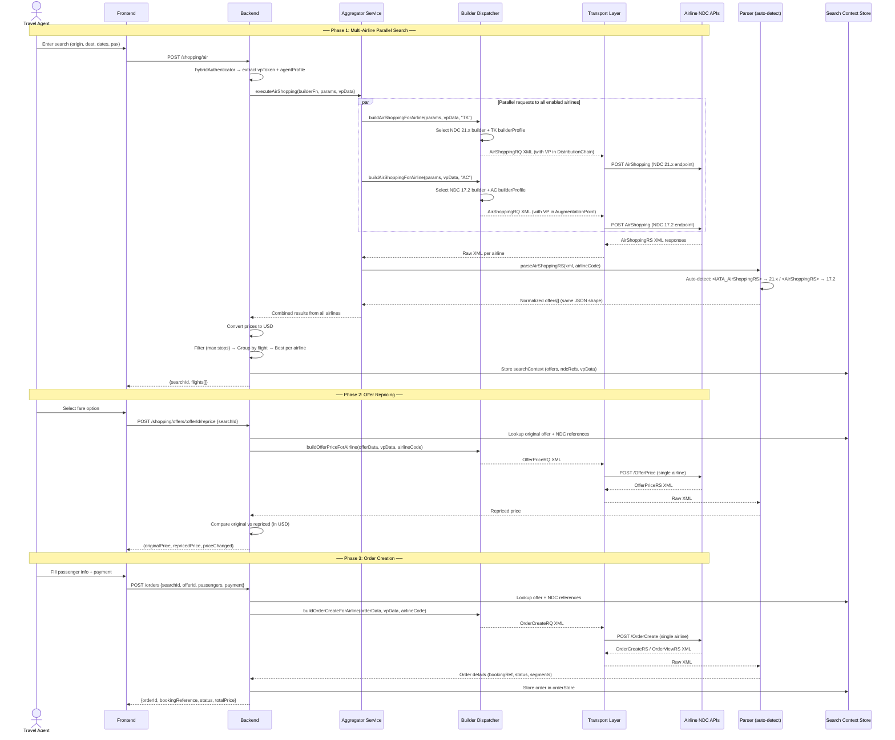
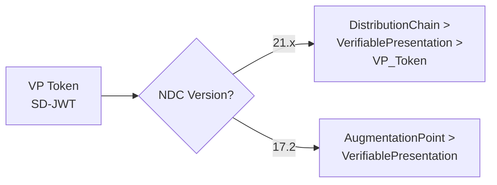
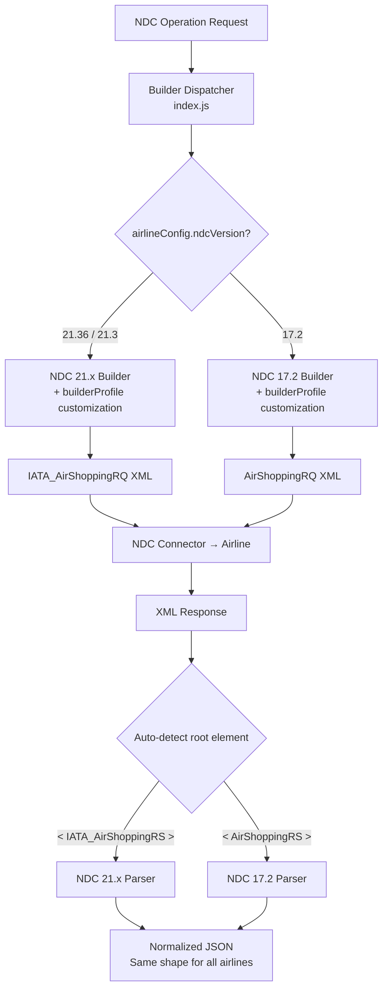
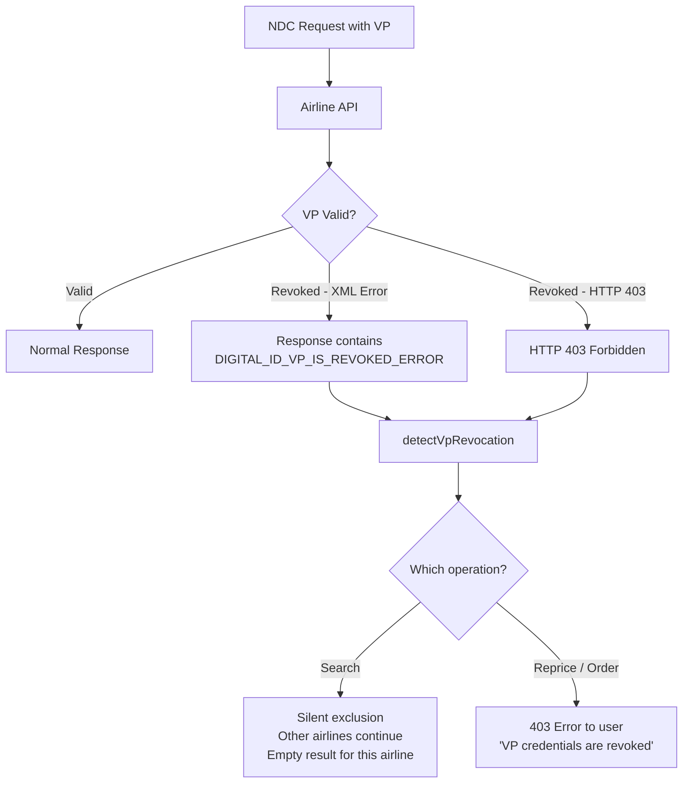
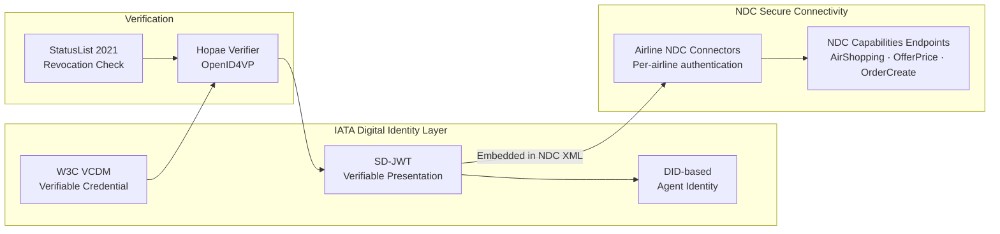

# IATA Digital Identity B2C PoC — NDC Aggregator

A Proof-of-Concept travel agency desktop application that integrates **IATA Digital Identity** (Verifiable Credentials via OpenID4VP) with airline **NDC** (New Distribution Capability) APIs. It demonstrates how verified agency credentials can be cryptographically embedded into every flight booking request — from search to booking confirmation — across multiple airlines using different NDC versions.

## Key Capabilities

| Capability | Details |
|------------|---------|
| **IATA Digital Identity** | Two authentication use cases — agency admin VC upload (UC1) and agent wallet QR scan (UC2) via OpenID4VP |
| **Multi-airline NDC aggregation** | Four airline integrations across NDC 17.2 and 21.x, queried in parallel |
| **NDC capabilities integration** | Unified connectivity to airline NDC endpoints with per-airline configuration and automatic version-based dispatching |
| **VP token injection** | SD-JWT Verifiable Presentation embedded in every NDC XML request for airline-side digital identity verification |
| **Unified booking flow** | Search → Reprice → Book with a single UI regardless of underlying NDC version differences |
| **Currency normalization** | All prices converted to USD server-side before reaching the frontend |
| **VP revocation handling** | Revoked credentials are detected in-band and handled gracefully (silent exclusion during search, clear error during booking) |
| **Fully externalized config** | All airline NDC endpoints, credentials, and namespace URIs driven by environment variables |

---

## System Architecture



### Monorepo Structure

```
ndc-aggregator/
├── client/                         # Frontend — Vite + React + Bootstrap
│   └── src/
│       ├── App.jsx                 # Router + global auth state
│       ├── pages/                  # Route-level page components
│       │   ├── login.jsx           # UC1 agency login + UC2 IATA ID Card entry
│       │   ├── authentication.jsx  # UC2 QR code display + polling
│       │   ├── homePage.jsx        # Search form landing page
│       │   ├── searchPage.jsx      # Flight search results
│       │   ├── flightDetailModal.jsx    # Fare detail modal with cabin grouping
│       │   ├── passengerInfoPage.jsx    # Passenger form + contact info
│       │   ├── confirmationPage.jsx     # Booking summary + payment
│       │   ├── bookingSuccessPage.jsx   # Booking confirmation
│       │   └── settingsPage.jsx    # Settings sidebar + VC management (UC1)
│       ├── shared/                 # Reusable components (SearchForm, etc.)
│       └── services/
│           ├── api.js              # All backend API calls with auth headers
│           └── helpers.js          # Airline logos, formatters, fare grouping
├── server/                         # Backend — Express.js (Node.js ESM)
│   └── src/
│       ├── server.js               # Express app setup & route mounting
│       ├── config.js               # Environment-driven airline configuration
│       ├── routes/
│       │   ├── authRoutes.js       # POST /auth/login, POST/GET/DELETE /auth/vc
│       │   ├── credentialRoutes.js # Credential status check & toggle
│       │   ├── verificationRoutes.js  # QR verification session lifecycle
│       │   └── ndcRoutes.js        # Authenticated NDC operations
│       ├── middlewares/
│       │   └── authMiddleware.js   # Hybrid auth: VP token / Agency token / Verification ID
│       ├── ndc/
│       │   ├── builders/           # Profile-driven NDC XML request builders
│       │   │   ├── index.js        # Version-based builder dispatcher
│       │   │   ├── agencyDataResolver.js  # Unified agency data resolution
│       │   │   ├── ndc21x/         # NDC 21.x builders (AirShopping, OfferPrice, OrderCreate)
│       │   │   └── ndc172/         # NDC 17.2 builders (AirShopping, OfferPrice, OrderCreate)
│       │   ├── parsers/            # Version-auto-detecting NDC XML response parsers
│       │   │   ├── airShoppingParser.js     # Auto-detect + NDC 21.x parsing
│       │   │   ├── airShopping172Parser.js  # NDC 17.2 parsing
│       │   │   ├── offerPriceParser.js      # Auto-detect + NDC 21.x
│       │   │   ├── offerPrice172Parser.js   # NDC 17.2
│       │   │   ├── orderViewParser.js       # Auto-detect + NDC 21.x
│       │   │   └── orderView172Parser.js    # NDC 17.2
│       │   ├── transports/         # NDC connectivity layer (airline client factories)
│       │   │   ├── index.js        # Transport registry & factory
│       │   │   ├── oauthRestTransport.js       # NDC connector (token-based auth)
│       │   │   ├── soapApiKeyTransport.js      # NDC connector (key-based auth)
│       │   │   └── soapSubscriptionTransport.js # NDC connector (subscription-based auth)
│       │   ├── clients.js          # Dynamic airline client registry
│       │   └── debugLogger.js      # XML request/response file logger
│       ├── services/
│       │   ├── ndcAggregatorService.js  # Multi-airline parallel orchestration
│       │   ├── repricingService.js      # OfferPrice flow with price comparison
│       │   ├── orderService.js          # OrderCreate flow
│       │   └── vpGenerationService.js   # UC1: Generate VP from stored VC via Hopae
│       ├── stores/
│       │   ├── searchContextStore.js    # In-memory search results + offers
│       │   ├── orderStore.js            # In-memory created orders
│       │   └── vcStore.js               # Agency VC (disk-persisted)
│       ├── verifiers/
│       │   └── hopaeClient.js           # Hopae OpenID4VP API client
│       ├── utils/
│       │   └── currencyConverter.js     # FX rates to USD
│       ├── sessionStore.js              # In-memory verification sessions (30-min TTL)
│       ├── agentProfileExtractor.js     # Agent profile from Hopae claims / VP JWT
│       └── appError.js                  # Custom error class
└── .env                            # Environment configuration (not committed)
```

### Runtime Topology

| Mode | Frontend | Backend | Communication |
|------|----------|---------|---------------|
| **Development** | Vite dev server `:5173` | Express `:3000` | Vite proxy `/api` → Express |
| **Production** | `vite build` → `server/public/` | Express `:3000` | Express serves SPA + API |

---

## Quick Start

```bash
# Install all dependencies
npm run install:all

# Copy and configure environment
cp server/.env.template server/.env
# Edit server/.env with your airline credentials, Hopae URL, etc.

# Run both frontend and backend in development
npm run dev

# Or run separately:
npm run start:dev    # Backend only (port 3000)
npm run client:dev   # Frontend only (port 5173)

# Production build
npm run build        # Builds client → server/public/
npm start            # Serves everything from Express
```

---

## IATA Digital Identity — Authentication Flows

The system supports two use cases for authenticating travel agents using **IATA Digital Identity** (W3C Verifiable Credentials + OpenID4VP).

### UC1 — Agency Admin Flow (VC Upload)

The agency admin logs in with credentials, uploads a W3C VCDM Verifiable Credential, and the system generates VP tokens on-the-fly for each subsequent NDC request via the Hopae verifier API.



### UC2 — Agent QR Scan Flow (OpenID4VP)

An individual travel agent authenticates by scanning a QR code with their IATA wallet app. The wallet presents a Verifiable Presentation directly to the Hopae verifier. The backend polls Hopae until verification is complete, then extracts the agent profile and VP token from the claims.



### Hybrid Authentication Middleware

The `hybridAuthenticator` supports two auth patterns (checked in priority order). Both paths produce the same downstream data: `vpToken` (SD-JWT) + `agentProfile` (DID, agency name, IATA number).



| Priority | Header | Use Case | VP Source |
|----------|--------|----------|-----------|
| 1 | `X-Agency-Token` | UC1: Agency admin flow | Generated on-the-fly from stored VC via Hopae |
| 2 | `X-Verification-Id` | UC2: Agent QR scan flow | Stored in session from wallet presentation |

---

## Booking Flow — Search → Reprice → Book

### End-to-End Sequence



### VP Token Injection

The VP token (SD-JWT) and agent profile data are embedded in different XML locations depending on the airline's NDC version and configuration:



---

## Multi-Airline NDC Integration

### NDC Connectivity Layer

The connectivity layer abstracts away airline-specific endpoint differences so the rest of the system works with a uniform client interface (`airShopping`, `offerPrice`, `orderCreate`, `orderView`).

Each connector provides:
- **Automatic retry** with exponential backoff (configurable max retries)
- **Debug logging** — all NDC XML requests/responses written to disk when `DEBUG_LOGS_ENABLED=true`
- **Response normalization** — airline-specific envelope wrapping automatically stripped before parsing

### Builder & Parser Architecture

Builders and parsers are organized by **NDC version**, not per airline. Each builder reads a `builderProfile` from `config.js` to customize XML output for the specific airline's requirements.



**Builder profiles** control dozens of XML generation parameters per airline without duplicating builder code:

| Profile Field | Purpose | Example Values |
|---------------|---------|---------------|
| `rootElement` | XML root element name | `n1:IATA_AirShoppingRQ` / `AirShoppingRQ` |
| `versionNumber` | Schema version attribute | `21.36`, `21.3`, `17.2` |
| `paxIdFormat` | Passenger ID format | `numeric` ("1"), `T_numeric` ("T1"), `PAX_numeric` ("PAX1") |
| `vpInjection` | VP token placement | `distributionChain` / `augmentationPoint` |
| `xmlnsPrefix*` | Custom namespace URIs | Airline-specific namespace declarations |
| `includePayloadAttributes` | Include IATA PayloadAttributes | `true` (21.36) / `false` (21.3) |
| `includeContacts` | Include contact details in Party | `true` (BA) / not set (AC) |

### VP Revocation Handling



---

## API Reference

### Public Routes (No Auth)

| Method | Path | Description |
|--------|------|-------------|
| `GET` | `/api/public/ping` | Health check |
| `POST` | `/api/public/verifications` | Start QR verification session (UC2) |
| `GET` | `/api/public/verifications/:id` | Poll verification status |

### Auth Routes

| Method | Path | Auth | Description |
|--------|------|------|-------------|
| `POST` | `/api/auth/login` | None | Agency login → returns `X-Agency-Token` |
| `POST` | `/api/auth/vc` | `X-Agency-Token` | Upload agency VCDM VC (UC1) |
| `GET` | `/api/auth/vc` | `X-Agency-Token` | Get stored VC status |
| `DELETE` | `/api/auth/vc` | `X-Agency-Token` | Delete stored VC |

### Credential Routes

| Method | Path | Description |
|--------|------|-------------|
| `GET` | `/api/credentials/status` | Check credential revocation status via Hopae StatusList |
| `PUT` | `/api/credentials/toggle` | Toggle credential revocation (revoke ↔ enable) |

### NDC Routes (Authenticated)

| Method | Path | Description |
|--------|------|-------------|
| `POST` | `/api/shopping/air` | Multi-airline parallel flight search |
| `POST` | `/api/shopping/offers/:offerId/reprice` | Reprice a specific offer with the origin airline |
| `POST` | `/api/orders` | Create booking from selected + repriced offer |
| `GET` | `/api/orders/:orderId` | Retrieve order details |
| `GET` | `/api/orders` | List orders for current session |
| `GET` | `/api/me` | Get current agent profile (DID, agency, IATA#) |

All NDC routes use `hybridAuthenticator` — accepts `X-Agency-Token` or `X-Verification-Id`.

---

## Data Stores

All stores are **in-memory** except `vcStore` which persists to disk:

| Store | File | Persistence | Purpose |
|-------|------|-------------|---------|
| **Session Store** | `sessionStore.js` | Memory (30-min TTL) | Verification sessions + agent profiles + VP tokens |
| **Search Context** | `searchContextStore.js` | Memory | Search results, parsed offers, NDC refs for reprice/order |
| **Order Store** | `orderStore.js` | Memory | Created orders with booking references |
| **VC Store** | `vcStore.js` | Disk (`server/data/`) | Agency VCDM Verifiable Credential (UC1) |

---

## Security & Trust Model



- **Verifiable Credentials** — W3C VCDM format, stored encrypted on disk (UC1) or presented via wallet (UC2)
- **Verifiable Presentations** — SD-JWT format, generated per-request with unique `tx_id` for correlation
- **VP in every NDC request** — airlines can independently verify the agent's identity and agency affiliation
- **Revocation** — StatusList 2021 mechanism; revoked credentials are detected both during verification and in airline responses
- **No hardcoded secrets** — all NDC endpoints, credentials, and namespace URIs externalized to `.env`
- **Agent profile cascade** — identity data flows from VC claims → airline config → empty (no fallback defaults in code)

---

## Environment Configuration

Copy `server/.env.template` to `server/.env` and fill in the required values. All airline-specific configuration is fully externalized:

| Category | Variables | Purpose |
|----------|-----------|---------|
| **Server** | `WEB_PORT`, `WEB_HOST_URL`, `WEB_ALLOWED_ORIGINS` | Express server config |
| **Agency Auth** | `AGENCY_USERNAME`, `AGENCY_PASSWORD` | UC1 login credentials |
| **Hopae Verifier** | `HOPAE_API_URL` | OpenID4VP verifier endpoint |
| **Per-airline core** | `{CODE}_NDC_ENDPOINT`, `AIRLINE_{CODE}_ENABLED` | NDC API base URL + enable flag |
| **Per-airline auth** | `{CODE}_API_KEY`, `{CODE}_CLIENT_ID/SECRET`, `{CODE}_SUBSCRIPTION_KEY` | NDC endpoint credentials |
| **Per-airline connectivity** | `{CODE}_SOAP_ENVELOPE_ATTRS`, `{CODE}_SOAP_HEADER_XML`, `{CODE}_SOAP_NS_*` | Airline-specific connectivity configuration |
| **Per-airline builder** | `{CODE}_XMLNS_*`, `{CODE}_DOCUMENT_*` | Builder profile namespace URIs |
| **Per-airline agency** | `{CODE}_AGENCY_NAME`, `{CODE}_IATA_NUMBER`, `{CODE}_AGENCY_ID` | Agency identity for NDC Party |
| **Per-airline endpoints** | `{CODE}_EP_AIRSHOPPING`, `{CODE}_EP_OFFERPRICE`, etc. | Operation-specific paths |
| **Debug & Demo** | `DEBUG_LOGS_ENABLED`, `DEMO_MODE` | Development aids |
| **PoC Filters** | `POC_MODE`, `POC_MAX_STOPS`, `POC_MAX_OFFERS` | Result filtering |

---

## Technology Stack

| Layer | Technologies |
|-------|-------------|
| **Frontend** | React 19, Vite 7, Bootstrap 5, React Router 7, React Select, React Datepicker, qrcode.react |
| **Backend** | Node.js (ESM), Express 5, Axios, fast-xml-parser, jwt-decode, uuid, dotenv |
| **Identity** | W3C VCDM, SD-JWT, OpenID4VP, DID, StatusList 2021 |
| **NDC Standards** | IATA NDC 17.2, IATA NDC 21.3, IATA NDC 21.36 |
| **NDC Integration** | IATA NDC XML messaging, per-airline endpoint connectivity, version-based dispatching |
| **Development** | nodemon, concurrently, cross-env |
