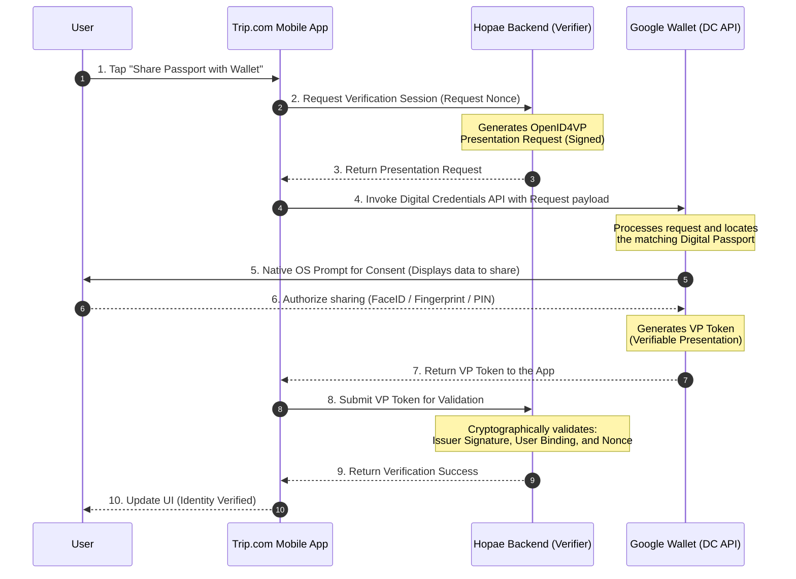

# Sequence Diagram — Use Case 3: OpenID4VP & DC API flow

This diagram illustrates the end-to-end flow for verifying a traveler's digital passport during the booking checkout using the W3C Digital Credentials API and Google Wallet.

