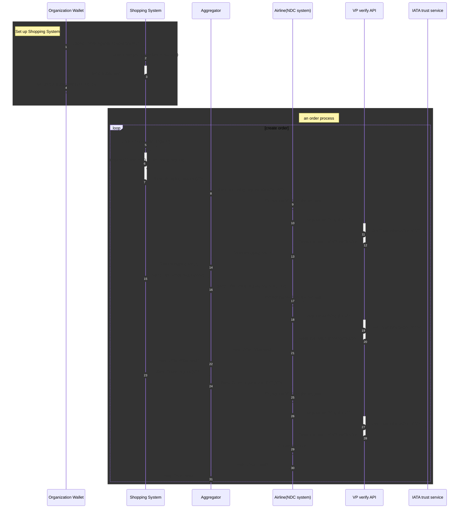

# Use Case 1: Travel Agency Credential

```mermaid
sequenceDiagram
autonumber
    participant OW as Organization Wallet
    participant S as Shopping System
    participant Agg as Aggregator
    participant Air as Airline(NDC system)
    participant VP as VP verify API
    participant IATA as IATA trust service

    rect
        Note left of OW: Set up Shopping System
        OW->>S: upload Travel Agency Credential(VC)
        S->>+S: create key pair (save key in storage)
        S->>-OW: send public key
        OW->>OW: set up the public key in DID docs
    end

    rect
        Note right of Air: an order process
        loop create order
	        S->>+S: Create transaction ID(tx ID)
	        S->>S: Create VP with tx ID for shopping request
	        S->>-Agg: Send shopping request(VP)
	        Agg->>Air: Send shopping request via NDC (VP)
	        Air->>Air: Extract the VP from the request
	        Air->>+VP: Request verifying the VP
	        VP->>IATA: Get Trust information of VP
	        VP->>-Air: Resp the result of VP varification
	        Air->>Agg: Resp shopping result
	        Agg->>S: Resp shopping result

	        S->>Agg: Send Offer Price request(VP)
	        Agg->>Air: Send Offer Price request via NDC (VP)
	        Air->>Air: Extract the VP from the request
	        Air->>+VP: Request verifying the VP
	        VP->>IATA: Get Trust information of VP
	        VP->>-Air: Resp the result of VP varification
	        Air->>Agg: Resp Offer Price result
	        Agg->>S: Resp Offer Price result

	        S->>Agg: Send Order request(VP)
	        Agg->>Air: Send Order request via NDC (VP)
	        Air->>Air: Extract the VP from the request
	        Air->>+VP: Request verifying the VP
	        VP->>IATA: Get Trust information of VP
	        VP->>-Air: Resp the result of VP varification
	        Air->>Air: Create an Order
	        Air->>Agg: Resp Order result
	        Agg->>S: Resp Order result
	      end
    end


```
