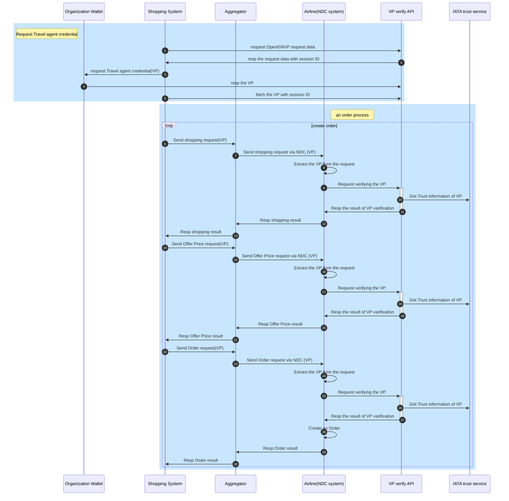

# Use Case 2: Travel Agent Credential

```mermaid
sequenceDiagram
autonumber
    participant OW as Organization Wallet
    participant S as Shopping System
    participant Agg as Aggregator
    participant Air as Airline(NDC system)
    participant VP as VP verify API
    participant IATA as IATA trust service

    rect rgb(200, 230, 255)
        Note left of OW: Request Travel agent credential
        S->>VP: request OpenID4VP request data
        VP->>S: resp the request data with session ID
        S->>OW: request Travel agent credential(VP)
        OW->>VP: resp the VP
        S->>VP: fetch the VP with session ID
    end

    rect rgb(200, 230, 255)
        Note right of Air: an order process
        loop create order
	        S->>Agg: Send shopping request(VP)
	        Agg->>Air: Send shopping request via NDC (VP)
	        Air->>Air: Extract the VP from the request
	        Air->>+VP: Request verifying the VP
	        VP->>IATA: Get Trust information of VP
	        VP->>-Air: Resp the result of VP varification
	        Air->>Agg: Resp shopping result
	        Agg->>S: Resp shopping result

	        S->>Agg: Send Offer Price request(VP)
	        Agg->>Air: Send Offer Price request via NDC (VP)
	        Air->>Air: Extract the VP from the request
	        Air->>+VP: Request verifying the VP
	        VP->>IATA: Get Trust information of VP
	        VP->>-Air: Resp the result of VP varification
	        Air->>Agg: Resp Offer Price result
	        Agg->>S: Resp Offer Price result

	        S->>Agg: Send Order request(VP)
	        Agg->>Air: Send Order request via NDC (VP)
	        Air->>Air: Extract the VP from the request
	        Air->>+VP: Request verifying the VP
	        VP->>IATA: Get Trust information of VP
	        VP->>-Air: Resp the result of VP varification
	        Air->>Air: Create an Order
	        Air->>Agg: Resp Order result
	        Agg->>S: Resp Order result
	      end
    end


```
