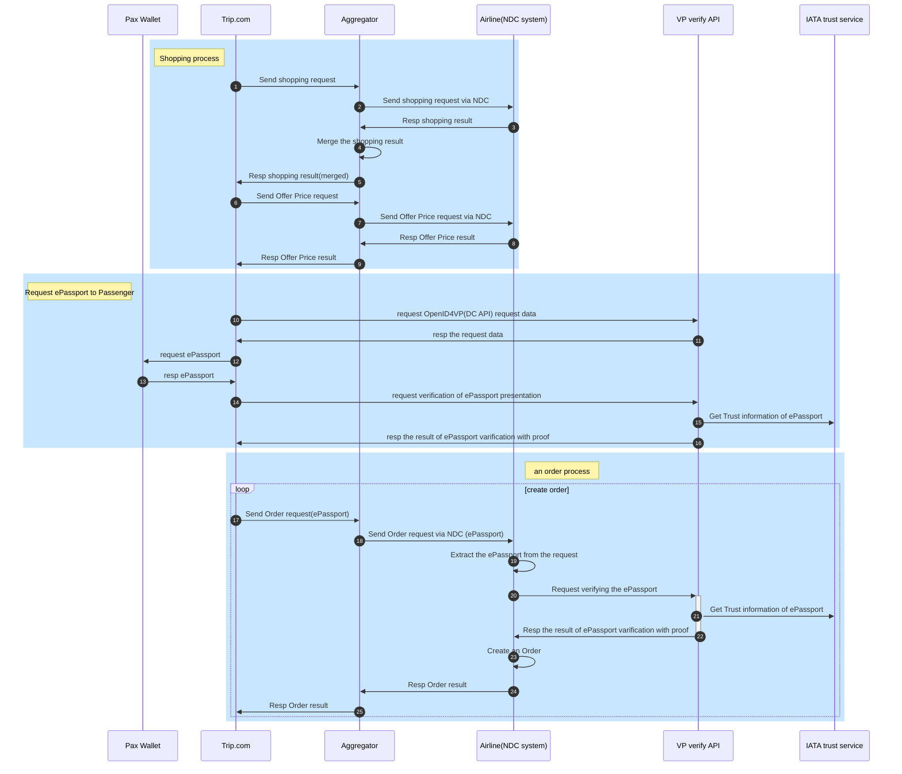

# Use Case 3: Passenger Credential (ePassport)

```mermaid
sequenceDiagram
autonumber
    participant PW as Pax Wallet
    participant S as Trip.com
    participant Agg as Aggregator
    participant Air as Airline(NDC system)
    participant VP as VP verify API
    participant IATA as IATA trust service

	rect rgb(200, 230, 255)
	Note left of S: Shopping process
		S->>Agg: Send shopping request
		Agg->>Air: Send shopping request via NDC
		Air->>Agg: Resp shopping result
		Agg->>Agg: Merge the shopping result
		Agg->>S: Resp shopping result(merged)

	    S->>Agg: Send Offer Price request
	    Agg->>Air: Send Offer Price request via NDC
	    Air->>Agg: Resp Offer Price result
	    Agg->>S: Resp Offer Price result
	end

    rect rgb(200, 230, 255)
        Note left of PW: Request ePassport to Passenger
        S->>VP: request OpenID4VP(DC API) request data
        VP->>S: resp the request data
        S->>PW: request ePassport
        PW->>S: resp ePassport
		S->>VP: request verification of ePassport presentation
		VP->>IATA: Get Trust information of ePassport
        VP->>S: resp the result of ePassport varification with proof
    end

    rect rgb(200, 230, 255)
        Note right of Air: an order process
        loop create order
	        S->>Agg: Send Order request(ePassport)
	        Agg->>Air: Send Order request via NDC (ePassport)
	        Air->>Air: Extract the ePassport from the request
	        Air->>+VP: Request verifying the ePassport
	        VP->>IATA: Get Trust information of ePassport
	        VP->>-Air: Resp the result of ePassport varification with proof
	        Air->>Air: Create an Order
	        Air->>Agg: Resp Order result
	        Agg->>S: Resp Order result
	      end
    end


```
